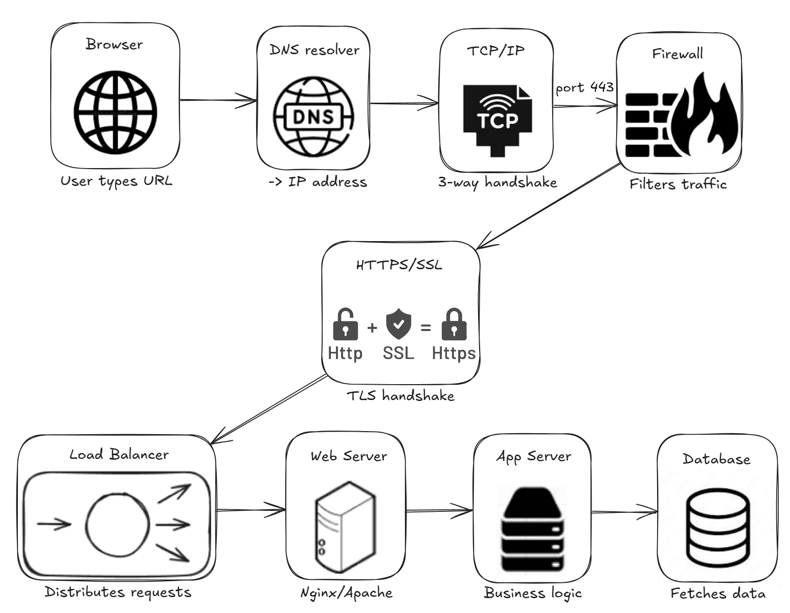

# What Happens When You Type https://www.google.com in Your Browser and Press Enter?

A technical deep-dive into the full request lifecycle of a web browser, from URL input to rendered page.
Written as part of the Holberton School networking curriculum.

---

---

## Blog Post

📝 [Read the full article on Medium](https://medium.com/@damross446/what-happens-when-you-type-https-www-google-com-in-your-browser-and-press-enter-3baeab1970fb
)

---

## Concepts Covered

| Step | Component | Role |
|------|-----------|------|
| 1 | DNS Request | Resolves `www.google.com` to an IP address |
| 2 | TCP/IP | Establishes a reliable connection (3-way handshake) |
| 3 | Firewall | Filters and protects traffic on port 443 |
| 4 | HTTPS/SSL | Encrypts communication via TLS handshake |
| 5 | Load Balancer | Distributes requests across multiple servers |
| 6 | Web Server | Handles HTTP, serves static assets (nginx/Apache) |
| 7 | Application Server | Runs business logic, generates the web page |
| 8 | Database | Stores and retrieves data |

---

## Files

| File | Description |
|------|-------------|
| `0-blog_post` | URL of the Medium blog post |
| `1-what_happen_when_diagram` | URL of the request lifecycle diagram |
| `assets/Request_Lifecycle.png` | Diagram image |

---

## Repository

- GitHub repository: `holbertonschool-network`
- Directory: `what_happens_when_your_type_google_com_in_your_browser_and_press_enter`

---

## Author

**Damien Rossi** - **[DaRKkem](https://github.com/DaRKkem)** — Holberton School, cohort C28, Auvergne-Rhône-Alpes
